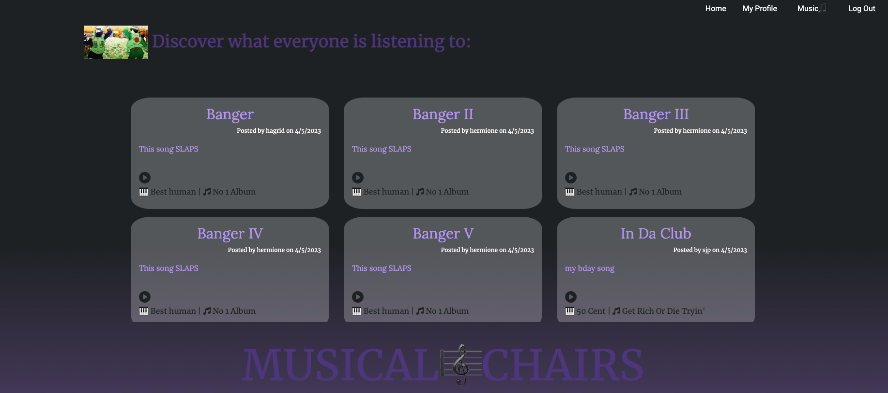
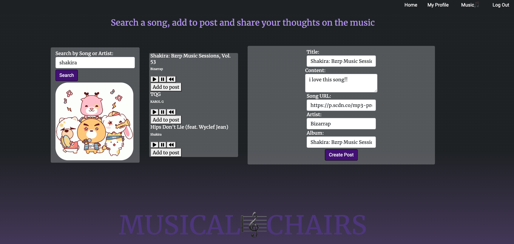
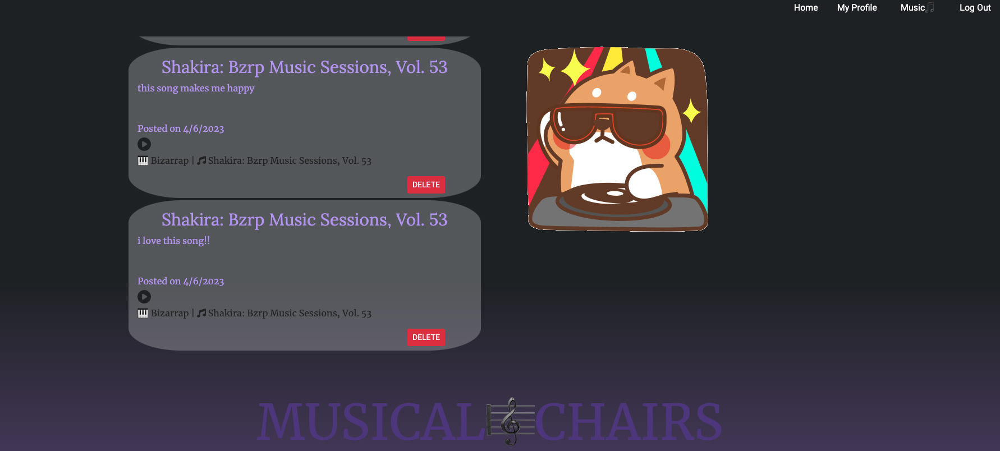

# Musical Chairs 

## Description:

Musical Chairs is a social media platform that allows users to post their favorite songs with content. Users can share their thoughts on the song in addition to providing a short sample of the track. 

## Installation

N/A

## Usage

Upon opening, the site presents a public feed of all users' posts and the option to play a song posted by another user.

If you would like to play a song posted by yourself or another user from the HomePage, you are taken to another webpage that contains a media player with a 30 second preview of the song.

If you would like to post a new song and share it with others, you can click the "Music" tab at the top of the navigation bar. On the "Music" webpage, you can search for a song to post by the artist name and/or track name. Once you click Search, you are presented with three tracks that most closely match your search. You have the option to play, pause, or restart a preview of the song. Once you have found the song you would like to post, click "Add to post". The title, song URL, artist, and album will automatically populate into the post form. You simply need to add your commentary within the "Content" portion of the form and click "Create Post" in order to share a song on the public feed.

Once you have created your post, you are taken to your personal profile where you can see past posts and your most current post. If you would like to delete a post, you can do so on your profile page. 

## Credits

Jeremy Racik
Patrick McKnight
Tiffany Tsai
Shavana Puchta

## Resources

Spotify Web API: https://developer.spotify.com/documentation/web-api

Bootstrap: https://cdn.jsdelivr.net/npm/bootstrap@5.1.3/dist/css/bootstrap.min.css

Google Fonts: https://fonts.google.com/

## Site

Deployed Site:

Github URL: https://github.com/TheRealGeneParmesan/Project-2
